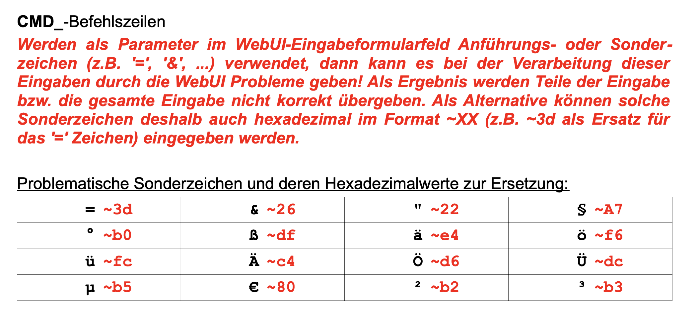

# CUxD_CMD_StringReplace_Mod
## CCU WebUI Modifikation zur automatischen Zeichenersetzung von CMD_ Parameter-Werten 

### :information_source: Hintergrund:
Die WebUI verhindert das Speichern von Werten, die bestimmte Sonderzeichen enthalten.
In der CUxD Dokumentation ist eine Ersetzungstabelle aufgeführt, in der die zu ersetzenden Zeichen aufgelistet sind:


### :information_source: Zweck:
**CUxD_CMD_StringReplace_Mod** ermöglicht das automatische Ersetzen lt. dieser Tabelle, sobald der Cursor das Eingabefeld verlässt.<br/>
_Beispiel:_<br/>


### :wrench: Installation:
- via SSH:

`wget -q -O- https://github.com/jp112sdl/CUxD_CMD_StringReplace_Mod/releases/download/1.0/install.sh | sh`

- via WebUI (Programme -> Skript testen):
```
string out;
string err;
system.Exec("wget -q -O- https://github.com/jp112sdl/CUxD_CMD_StringReplace_Mod/releases/download/1.0/install.sh | sh", &out, &err);
WriteLine("Output: \n"#out);
WriteLine("Error : \n"#err);
  ```
  
:white_check_mark: Bei erfolgreicher Ausführung erscheint folgende Ausgabe:
```
/www/webui/webui.js: encodeStringCUxD function added.
/www/config/ic_common.tcl: modified.
```
:warning: _Sollte die Modifikation bereits erfolgt sein und das Skript ein weiteres Mal ausgeführt werden, erscheint:_
```
/www/webui/webui.js: encodeStringCUxD function exists.
/www/config/ic_common.tcl: already modified.
```

### :recycle: Deinstallation:
- siehe "Installation", es ist im Kommando jedoch `install.sh` durch `uninstall.sh` zu ersetzen.
